# Line1 CRC V2
##### contact moghbaie@rockefeller.edu for any questions
##### 12/10/2018

We had 8 groups as follow:

|	Site of Tumor	|	Condition	|	Collection #	| Age	|	Sex	|	Diagnosis	| Comment	|
| ------------- | ------------- |------------- | ------------- |------------- | ------------- |------------- |
| Ovary  | Igg  |	144	|	56	|	F 	|	Krukenberg Carcinoma	|	Very very strong L1 expresse	|
| Ovary  | Normal  |	144	|	56	|	F 	|	Krukenberg Carcinoma	|	Very very strong L1 expresse	|
|	Liver	|	Igg	|	159	|	35	|	M 	|	Metastatic Rectal Adenocarcinoma	|	Strong 3/3 in liver and node	|
|	Liver	|	Normal	|	159	|	35	|	M 	|	Metastatic Rectal Adenocarcinoma	|	Strong 3/3 in liver and node	|
|	Liver	|	Tumor	|	159	|	35	|	M 	|	Metastatic Rectal Adenocarcinoma	|	Strong 3/3 in liver and node	|
|	Colon	|	Igg	|	163	|	75	|	F 	|	Adenocarcinoma	|	2/3 expression	|
|	Colon	|	Normal	|	163	|	75	|	F 	|	Adenocarcinoma	|	2/3 expression	|
|	Colon	|	Tumor	|	163	|	75	|	F 	|	Adenocarcinoma	|	2/3 expression	|

This project is done following previous project(Line1 CRC V1)
Detail report exists in following link:
https://docs.google.com/document/d/1Rdn2QTG43JNEqdcNk980U1I6ZvwONEP2scBosMZBJk0/edit

Project code and data is organized in following order:

* [Code](https://github.com/moghbaie/L1_CRC_v2/tree/master/Code/ReadMe_Code.md)
* [Input_data](https://github.com/moghbaie/L1_CRC_v2/tree/master/Input_data/ReadMe_Input.md)
* [Result](https://github.com/moghbaie/L1_CRC_v2/tree/master/Result)
* [Image](https://github.com/moghbaie/L1_CRC_v2/tree/master/Image)

## Project Pipeline:
</img>

## QC:

## Imputation:
### Comparison before - after imputation:
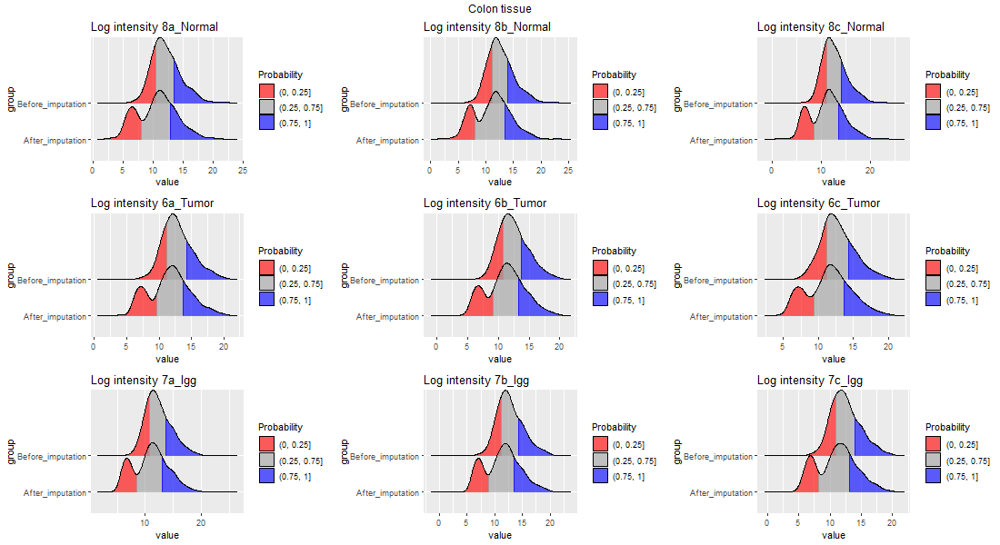</img>
 
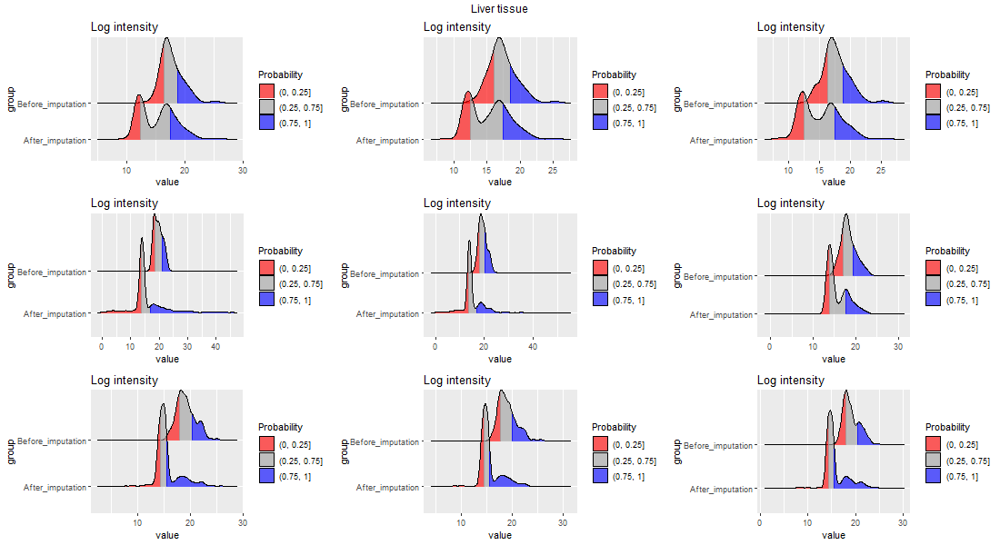</img>
 
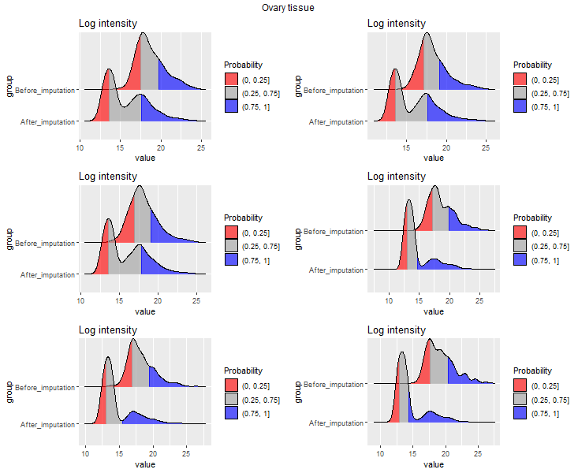</img>

### Average intensities before - after imputation:
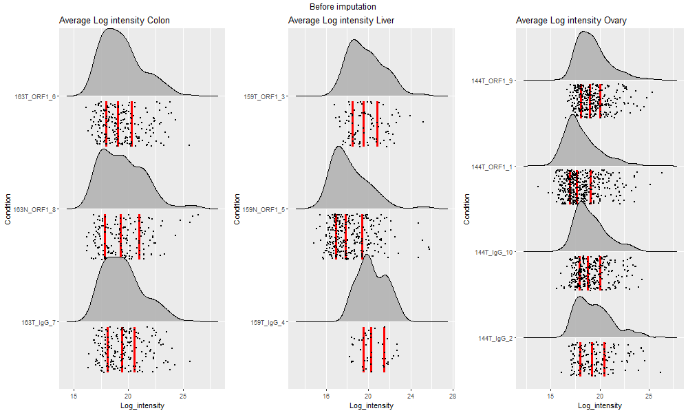
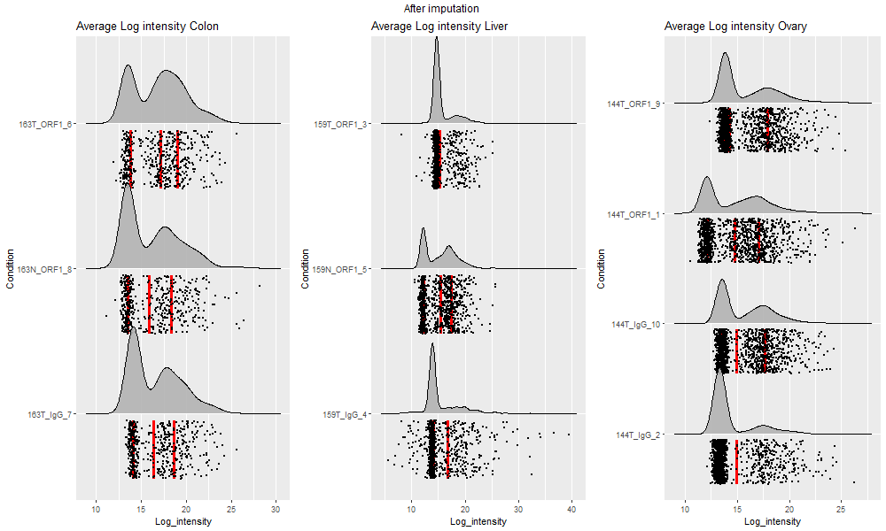

## ANOVA result: 

### Venndiagram

### Volcano plots and mutations
#### comparison between Colon Tumor tissue against ORF1 and IgG
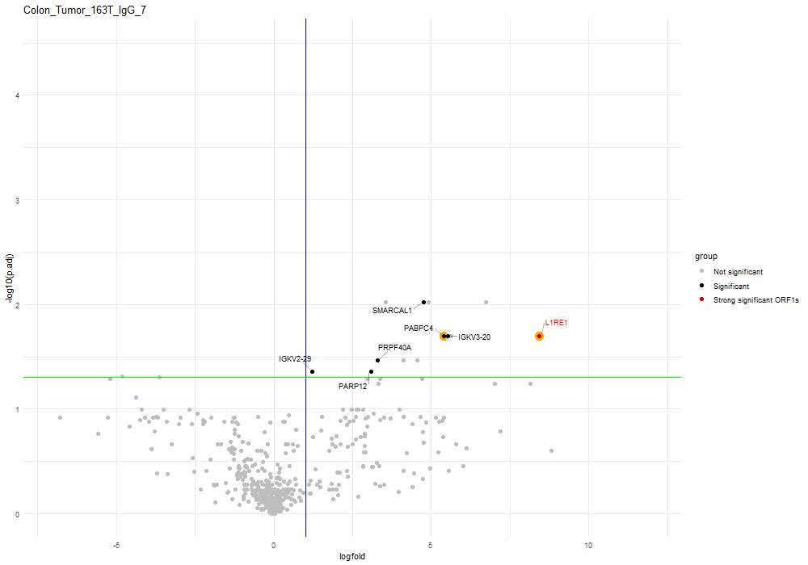
 
#### comparison between Colon Tumor tissue and normal tissue against ORF1 
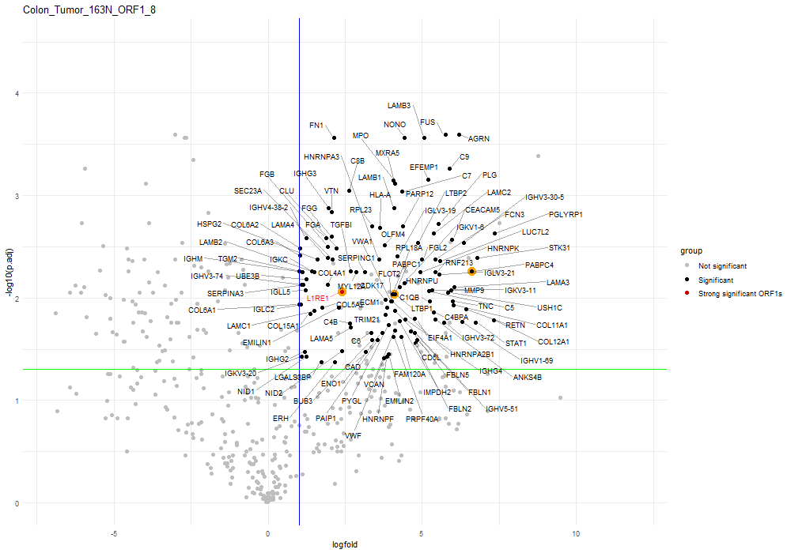
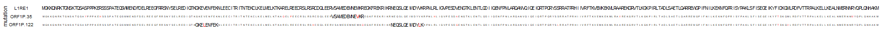
 
#### comparison between Liver Tumor tissue against ORF1 and IgG 

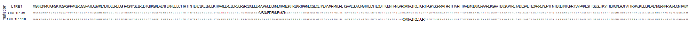
 
#### comparison between Liver Tumor tissue and normal tissue against ORF1
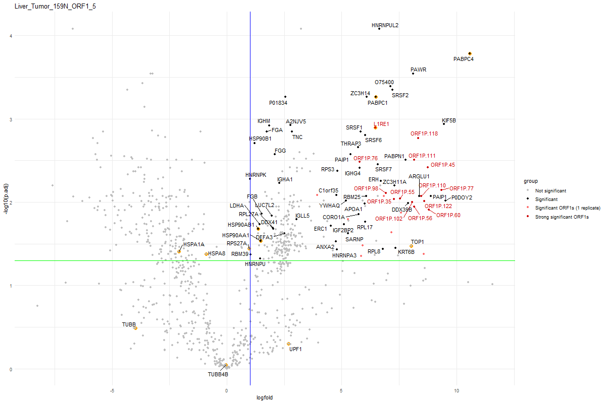

 
#### comparison between Ovary Tumor tissue against ORF1 and IgG 
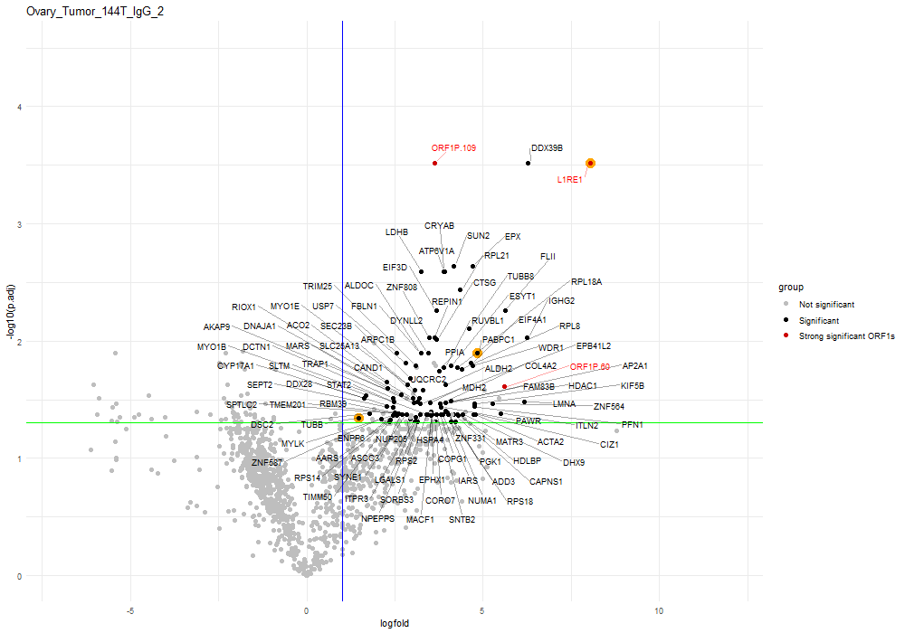
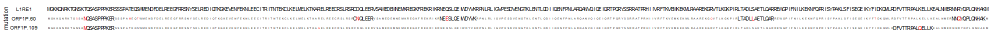
 
#### comparison between Ovary Tumor tissue and normal tissue against ORF1 
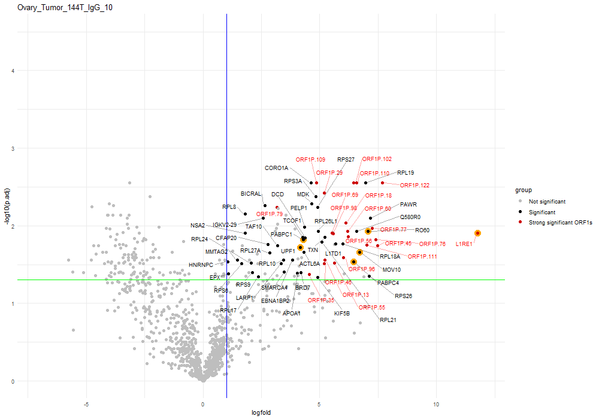
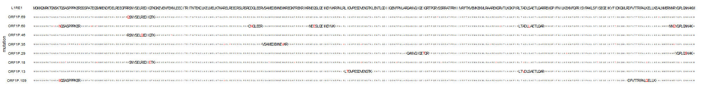

## Integrated plot:
### Venndiagram:
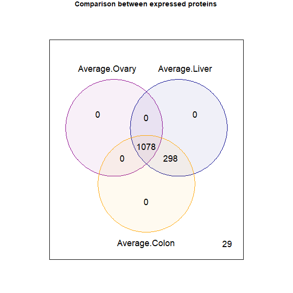

### MDS plot:

 
 
### Polar map of significant proteins in Colon cancer in different tissue:
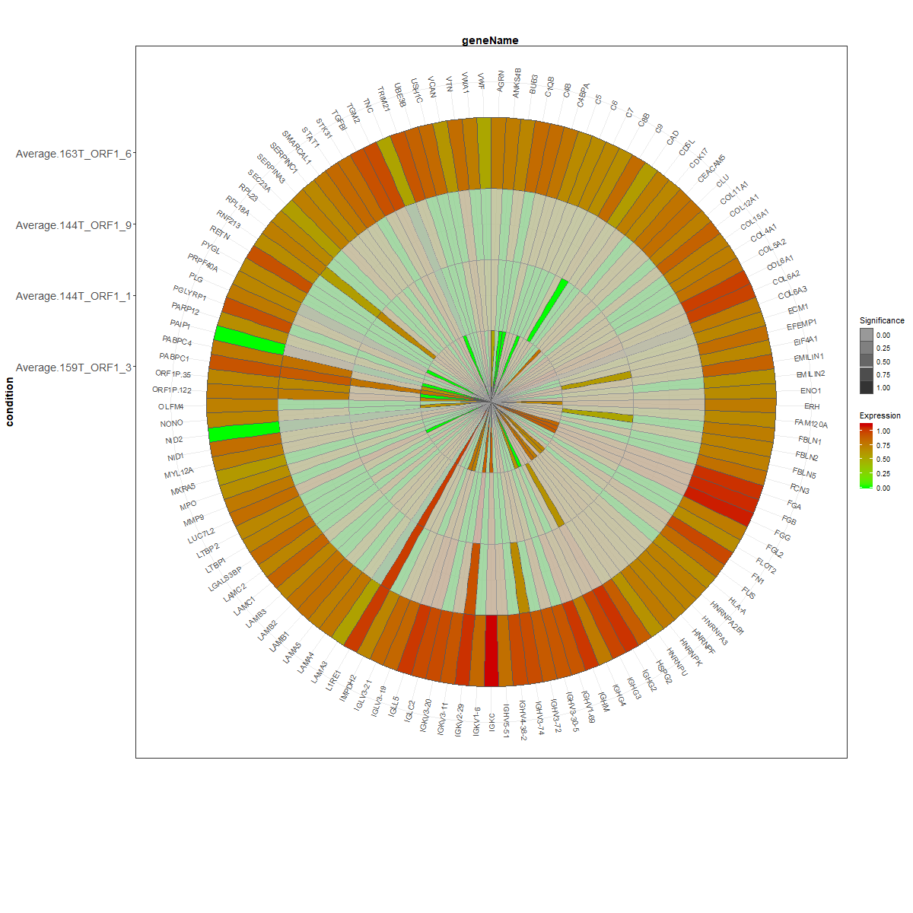

### Heat map of all significant proteins across different tissues:
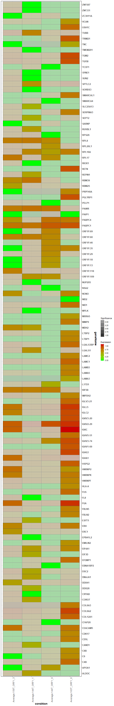